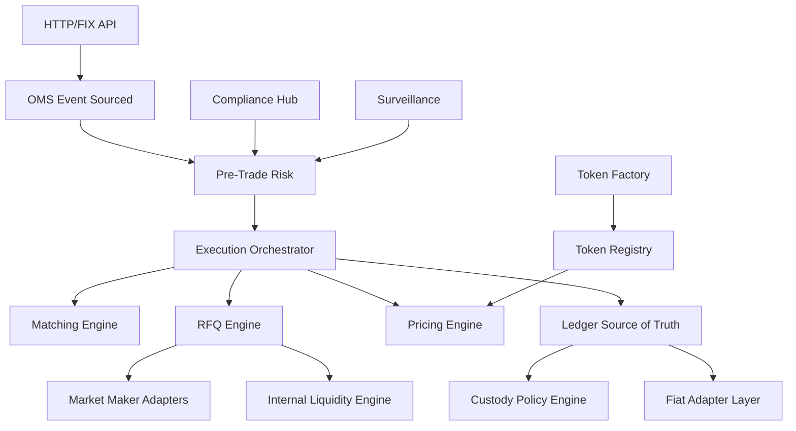

# MetaSwap V3 Production Architecture

## Domains

- Trading: OMS, deterministic matching engine, RFQ engine, execution orchestration.
- Pricing/Liquidity: oracle aggregation, RFQ consensus, inventory model, internal liquidity, hedging adapters.
- Risk: pre-trade gate, post-trade monitoring, circuit breakers, exposure limits.
- Ledger/Custody: internal ledger source of truth, settlement, MPC/HSM policy engine.
- Fiat: SEPA, SWIFT, card and virtual IBAN adapters, reconciliation and safeguarding.
- Compliance: KYC/KYB, AML, Travel Rule, sanctions/PEP, market abuse surveillance.
- Tokenization: multi-chain token factory, legal metadata, controlled listing lifecycle.

## Flow

## Production Migration Path

The current implementation is a runnable modular core. For regulated production, split processes by domain:

- Rust/C++: `matching-engine`, market data publisher, low-latency pre-trade checks.
- Go: `rfq-engine`, `custody-orchestrator`, chain indexers, external venue adapters.
- Kotlin/Java: `ledger-service`, `fiat-gateway`, `compliance-hub`.
- TypeScript: API gateway, admin console, integration dashboards.

Persist event streams in Kafka/Redpanda, market data in ClickHouse, ledger/compliance state in PostgreSQL, and distributed operational state in FoundationDB or CockroachDB.
